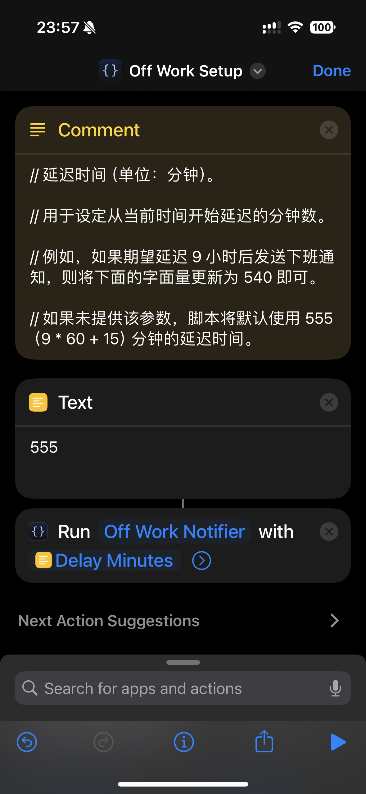

# Off Work Reminder

## 简介

Off Work Reminder 是一个用于 iOS 的自动化下班提醒工具。它结合 [Shortcuts（快捷指令）](https://support.apple.com/zh-cn/guide/shortcuts/welcome/ios)和 [Scriptable](https://scriptable.app/)，能在我们首次连接公司 Wi-Fi 时设置一个定时通知，以在满足工时要求后推送下班提醒。有助于我们合理安排工时，避免过度用脑，同时又能保证不会出现早退的情况。

## 原理

- **Shortcuts 自动化**：当我们的手机连接到指定的公司 Wi-Fi 时，自动触发快捷指令。

- **传递延时参数**：快捷指令将定时通知的预计延迟分钟数传递给 Scriptable 中的 `Off Work Notifier` 脚本。
  - 比如 9:00 上班，18:00 下班，工作时长 8 小时，午休 1 小时，那么在 9:00 连接至公司 Wi-Fi 时，需要传递 540 分钟（9 小时）给 `Off Work Notifier` 脚本。

- **Scriptable 脚本**：`Off Work Notifier` 脚本获取当前时间，在满足延时设定的工作时长后，推送下班通知。

## 操作步骤

1. 导入 Scriptable 脚本

    

    
截图

    

    

    - 打开 Scriptable 应用，点击右上角 + 创建一个新的脚本。

    - 将 [`Off Work Notifier`](./scripts/off-wor-notifier.js) 文件中的代码复制并粘贴进去。

    - 将脚本重命名为 `Off Work Notifier` 后选择 Done。

2. 创建一个快捷指令或是直接在[这个指令的基础上](https://www.icloud.com/shortcuts/00a8a272eff046cd99b80a2d104dec63)进行修改

    

    
截图

    

    

    1. 打开 Shortcuts 应用，创建一个新的快捷指令。

    2. 添加以下两步操作：

        1. 搜索并选择 Documents > Text，设置延时的总分钟数（例如，9 小时即 540 分钟）并存入变量 `Delay Minutes`。

        2. 搜索并选择 Scriptable > Run Script `Off Work Notifier` 脚本，并将 `Delay Minutes` 作为参数传递给脚本。

3. 设置 Automation

    

    
截图

    

    

    1. 在 Shortcuts 中创建一个新的 Automation，选择 WLAN 连接作为触发条件，指定公司 Wi-Fi。

    2. 选择刚刚创建的 Off Work Setup 快捷指令。

    3. 保存自动化设置。

## 使用说明

- 首次运行检测：该脚本每个自然日只会在第一次连接公司 Wi-Fi 时设置定时通知，有效避免重复提醒。

- 自定义时间：在 Shortcuts 中更新 `Delay Minutes` 的值即可调整提醒时间。

- 手动测试：你可以手动运行 Off Work Setup 快捷指令进行测试。

## 已知问题

- 像这类基于 Wi-Fi 连接触发的 Automation 每次运行时都会显示通知，[且目前没有办法静默执行](https://www.reddit.com/r/shortcuts/comments/170dopx/comment/k3jzxj8/?utm_source=share&utm_medium=web3x&utm_name=web3xcss&utm_term=1&utm_content=share_button)。由于 iPhone 会在锁屏后自动断开 Wi-Fi 连接，因此在重新连接至 Wi-Fi 时会再次运行，导致这种情况频繁发生，容易积攒通知，影响用户体验。