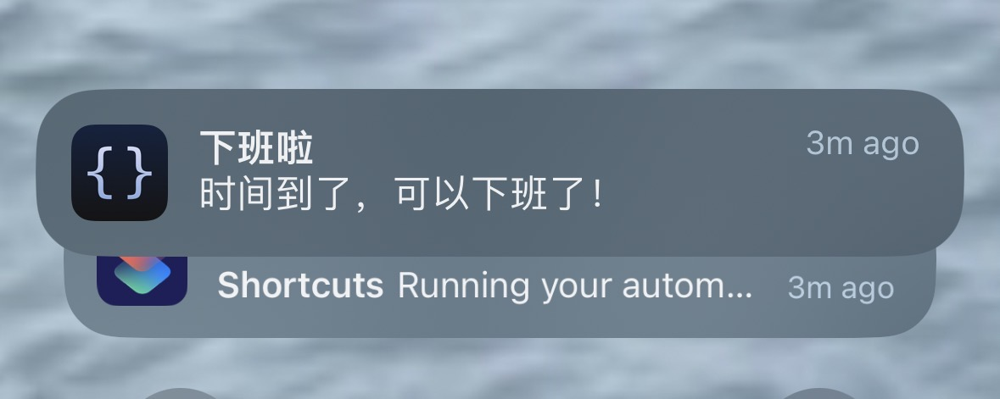
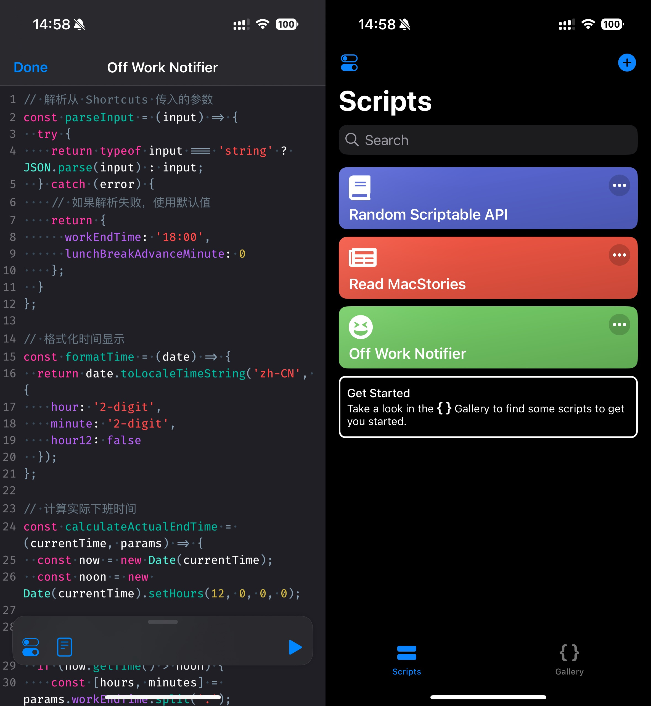
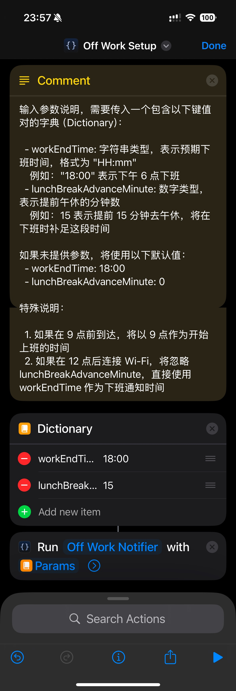
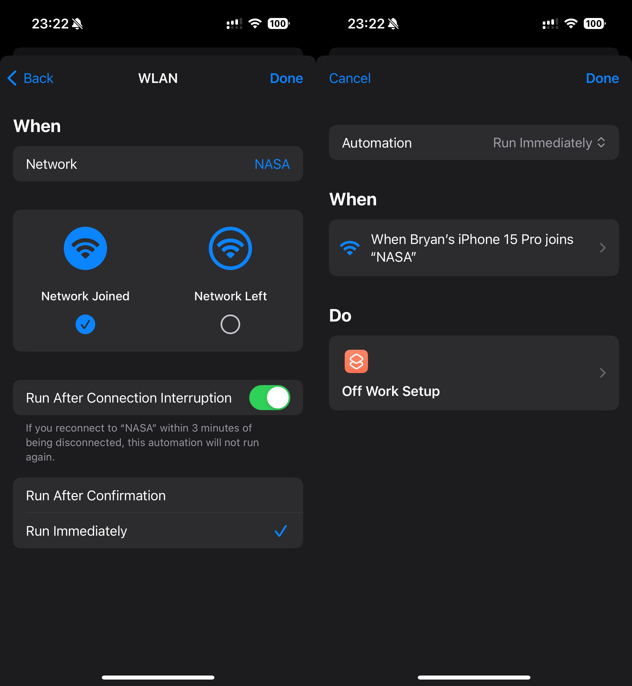

# Off Work Reminder

## 简介

Off Work Reminder 是一个用于 iOS 的自动化下班提醒工具。它结合 [Shortcuts（快捷指令）](https://support.apple.com/zh-cn/guide/shortcuts/welcome/ios)和 [Scriptable](https://scriptable.app/)，能在我们首次连接公司 Wi-Fi 时设置一个定时通知，以在满足工时要求后推送下班提醒。有助于我们合理安排工时，避免过度用脑，同时又能保证不会出现早退的情况。

下班时间计算规则

### 上午到达的情况

1. **早到（09:00 前）**

   - 不提前午休：18:00 下班

   - 提前 15 分钟午休：18:15 下班

2. **准时到达（09:00）**

   - 不提前午休：18:00 下班

   - 提前 15 分钟午休：18:15 下班

3. **晚到（09:00 后，12:00 前）**

   - 09:20 到达，不提前午休：18:20 下班

   - 09:20 到达，提前 15 分钟午休：18:35 下班

   - 09:40 到达，不提前午休：18:40 下班

   - 09:40 到达，提前 15 分钟午休：18:55 下班

### 下午到达的情况

- **12:00 后到达**

   - 视为上午请假，统一在 18:00 推送下班通知

   - 不考虑迟到或请假时间

   - 不考虑提前午休的情况

### 不支持的特殊情况（需自行处理）

- 上午请假：比如 09:00 到 10:00 请假，10:00 前到达，仍会按晚到的情况进行计算

- 下午迟到或请假：比如 14:00 到达，仍会在 18:00 推送通知，需自行计算时间下班时间， 例如：

    - 当日请假至 14:00，14:00 到达，18:00 下班

    - 上午请假，13:00 应到达，但迟到未请假，14:00 到达，19:00 下班

- 临时外出：公司规定临时外出需要在下班后补足工作时长的

## 原理

- **Shortcuts 自动化**：当我们的手机连接到指定的公司 Wi-Fi 时，自动触发快捷指令。

- **参数传递**：快捷指令将包含下班时间和提前午休时间的字典（Dictionary）传递给 Scriptable 中的 `Off Work Notifier` 脚本。

  - `workEndTime`：规定下班时间，例如 "18:00"

  - `lunchBreakAdvanceMinute`：提前进入午休的分钟数，例如提前 15 分钟下楼吃午饭则设为 15

- **Scriptable 脚本**：`Off Work Notifier` 脚本根据当前连接 Wi-Fi 的时间和传入的参数计算实际下班时间：

  - 如果是 9 点前到达，将以 09:00 作为开始上班的时间

  - 如果是 12 点前连接，将考虑提前午休的时间，延后下班时间

  - 如果是 12 点后连接，将直接使用设定的下班时间发送提醒

## 操作步骤

1. 导入 Scriptable 脚本

    

    
截图

    

    

    - 打开 Scriptable 应用，点击右上角 + 创建一个新的脚本。

    - 将 [`Off Work Notifier`](./scripts/off-work-notifier.js) 文件中的代码复制并粘贴进去。

    - 将脚本重命名为 `Off Work Notifier` 后选择 Done。

2. 创建一个快捷指令或是直接在[这个指令的基础上](https://www.icloud.com/shortcuts/826ef9a8e1494a9e99701f9b0e96511b)进行修改

    

    
截图

    

    

    1. 打开 Shortcuts 应用，创建一个新的快捷指令。

    2. 添加以下两步操作：

        1. 添加 Dictionary 动作，设置两个键值对：

           - `workEndTime`: 文本类型，设置为预期下班时间，如 "18:00"

           - `lunchBreakAdvanceMinute`: 数字类型，设置提前午休的分钟数，如 15

        2. 搜索并选择 Scriptable > Run Script `Off Work Notifier` 脚本，并将创建的 Dictionary 作为参数传递给脚本。

3. 设置 Automation

    

    
截图

    

    

    1. 在 Shortcuts 中创建一个新的 Automation，选择 WLAN 连接作为触发条件，指定公司 Wi-Fi。

    2. 选择刚刚创建的 Off Work Setup 快捷指令。

    3. 保存自动化设置。

## 使用说明

- 首次运行检测：该脚本每个自然日只会在第一次连接公司 Wi-Fi 时设置定时通知，有效避免重复提醒。

- 自定义时间：在 Shortcuts 中更新 Dictionary 的值即可调整下班时间和提前午休时间。

- 手动测试：你可以手动运行 Off Work Setup 快捷指令进行测试。

## 已知问题

- 像这类基于 Wi-Fi 连接触发的 Automation 每次运行时都会显示通知，[且目前没有办法静默执行](https://www.reddit.com/r/shortcuts/comments/170dopx/comment/k3jzxj8/?utm_source=share&utm_medium=web3x&utm_name=web3xcss&utm_term=1&utm_content=share_button)。由于 iPhone 会在锁屏后自动断开 Wi-Fi 连接，因此在重新连接至 Wi-Fi 时会再次运行，导致这种情况频繁发生，容易积攒通知，影响用户体验。